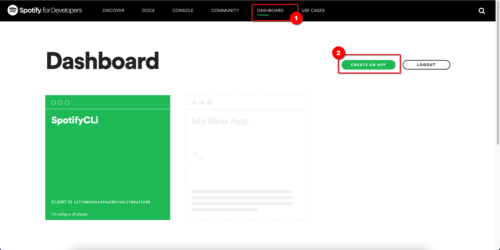
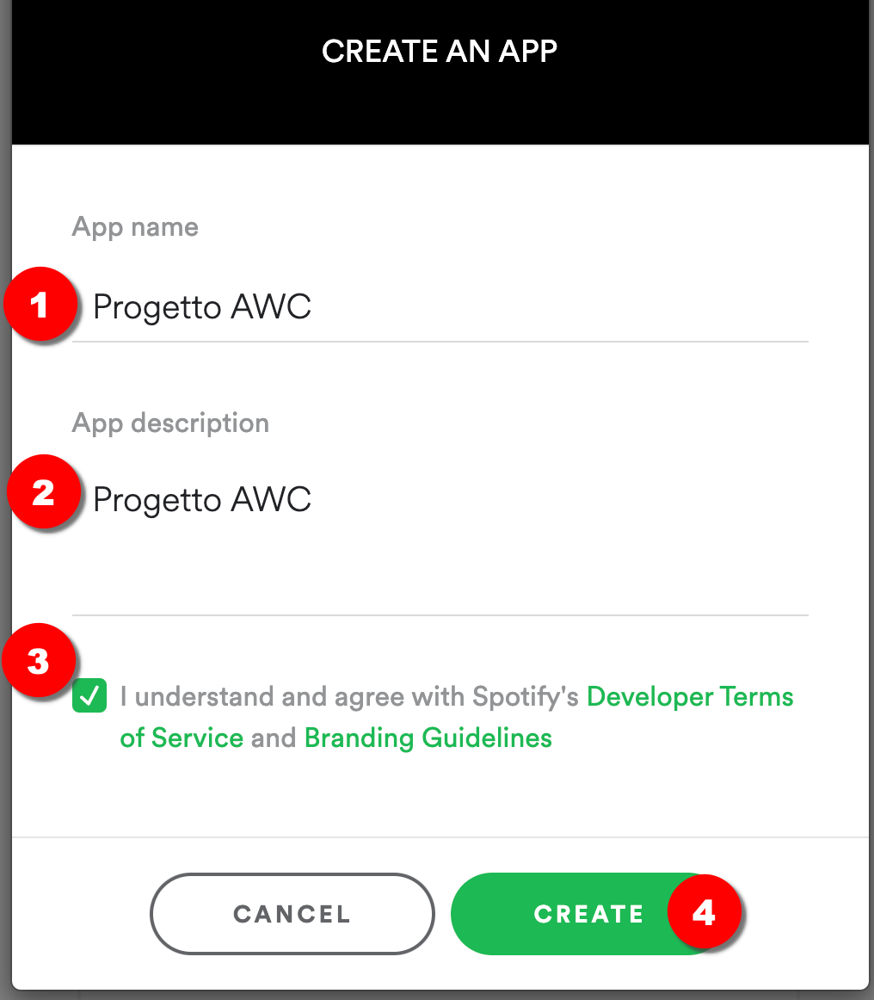
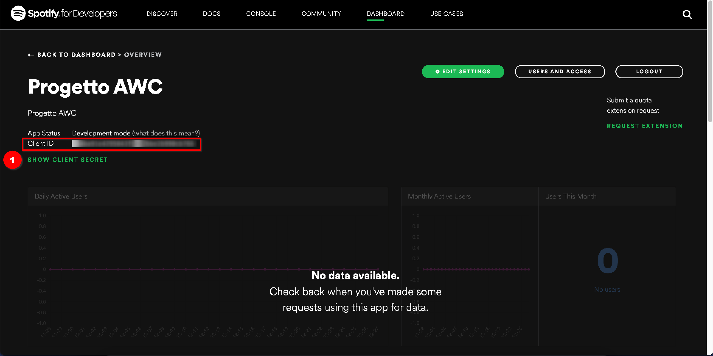

# Api key spotify
Per ottenere una chiave api per spotify, visita la pagina: https://developer.spotify.com/

Clicca su Dashboard ed effettua il login con le credenziali spotify. Se non le hai crea un account

Nella dashboard clicca su: *`CREATE AN APP`*




Assegna un nome e una descrizione all'applicazione accetta i termini di servizio e clicca su: *`CREATE`*





Nella dashboard troverai i tuoi Client ID e Client Secret, ovvero le credenziali che la tua Applicazione dovrà utilizzare per accedere ai servizi di Spotify.





Una volta ottenuti i Client ID e Client Secret andranno inseriti nel codice javascript e utilizzati per ottenere un token di accesso. l'*`access token`* è necessario per interagire con le API.

**Il token ha una validità di un'ora dopo di che dovrà essere rigenerato**


```javascript
    const client_id = "<Client ID>"
    const client_secret = "<Client Secret>"
    var url = "https://accounts.spotify.com/api/token"

    fetch(url, {
        method: "POST",
        headers: {
            Authorization: "Basic " + btoa(`${client_id}:${client_secret}`),
            "Content-Type": "application/x-www-form-urlencoded",
        },
        body: new URLSearchParams({ grant_type: "client_credentials" }),
    })
    .then((response) => response.json())
    .then((tokenResponse) =>
         console.log(tokenResponse.access_token)
         //Sarebbe opportuno salvare il token nel local storage
        )

```
Il token così ottenuto dovrà essere inlcuso negli header di ogni richiesta successiva specificandolo nel formato: `Authorization: Bearer <token>`,

Nell'esempio seguente è utilizzato per eseguire la [ricerca di un album](https://developer.spotify.com/documentation/web-api/reference/#/operations/search):

```javascript
fetch("https://api.spotify.com/v1/search?type=album&q=The Wall", {
        headers: {
            "Content-Type": "application/json",
            Authorization: "Bearer " + response.access_token,
        },
    })
    .then((response) => response.json())
    .then((searchResults) =>
        document.write(
            `<pre>${JSON.stringify(searchResults, null, 2)}</pre>`
        )
    )
```
